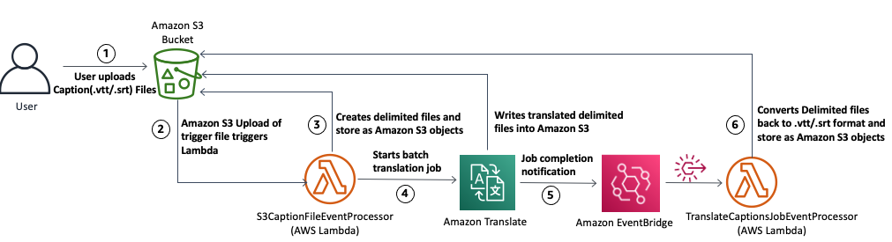

# Translating Captions files (VTT, SRT) using Amazon Translate

## About
This project contains source code and supporting files for a serverless pipeline for translating Caption files in VTT and SRT formats using Amazon Translate that you can deploy with the SAM CLI. It includes the following files and folders.

- translate_captions - Code for the application's Lambda functions.
- translate-captions-template.yaml - A template that defines the application's AWS resources.

The application uses several AWS resources, including AWS Lambda functions, AWS Step Functions and Amazon Simple Notification Service (SNS). These resources are defined in the `translate-captions-template.yaml` file in this project. 

Important: this application uses Amazon Translate and there are costs associated with this service after the Free Tier usage - please see the   [Amazon Translate pricing page](https://aws.amazon.com/translate/pricing/) for details.

### Reference
[Translating Captions files with Amazon Translate](https://aws.amazon.com/blogs/machine-learning/translate-video-captions-and-subtitles-using-amazon-translate/) 

## Solution Architecture


## Building and Deploying the application

* AWS CLI - Installed and Configured with a valid profile [Install the AWS CLI](https://docs.aws.amazon.com/cli/latest/userguide/cli-chap-install.html)
* SAM CLI - [Install the SAM CLI](https://docs.aws.amazon.com/serverless-application-model/latest/developerguide/serverless-sam-cli-install.html)
* [Python 3 installed](https://www.python.org/downloads/)
* The Bash shell. For Linux and macOS, this is included by default. In Windows 10, you can install the [Windows Subsystem for Linux](https://docs.microsoft.com/en-us/windows/wsl/install-win10) to get a Windows-integrated version of Ubuntu and Bash.

### Setup
Download or clone this repository.

    $ git clone git@github.com:aws-samples/amazon-translate-video-subtitles-captions-translation.git
    $ cd amazon-translate-video-subtitles-captions-translation

To create a new bucket for deployment artifacts, run `create-bucket.sh`.

    $ ./create-bucket.sh
    make_bucket: lambda-artifacts-a1b2c3d4e5e6

### Deploy

To deploy the application, run `deploy.sh`.

    $ ./deploy.sh
    BUILD SUCCESSFUL in 1s
    Successfully packaged artifacts and wrote output template to file out.yml.
    Waiting for changeset to be created..
    Successfully created/updated stack - translate-captions-stack

This script uses AWS CloudFormation to deploy the Lambda functions and an IAM role. If the AWS CloudFormation stack that contains the resources already exists, the script updates it with any changes to the template or function code.

## How it works
* Deploy the stack  with required parameters (`SourceLanguageCode`, `TargetLanguageCode` and `TriggerFileName`)
* Upload caption files (.VTT, .SRT) in the `input` folder of the created Amazon S3 bucket.
* Upload the 0-byte file with name matching the `TriggerFileName` parameter in the `input` folder
* The solution will trigger and after few minutes , you will see the translated JSON files in `output` folder in the same bucket


### Cleanup

To delete the sample application that you created, use the AWS CLI. Assuming you used your project name for the stack name, you can run the following:

```bash
aws cloudformation delete-stack --stack-name translate-captions-stack
```

## License

This solution is licensed under the MIT-0 License. See the LICENSE file.


